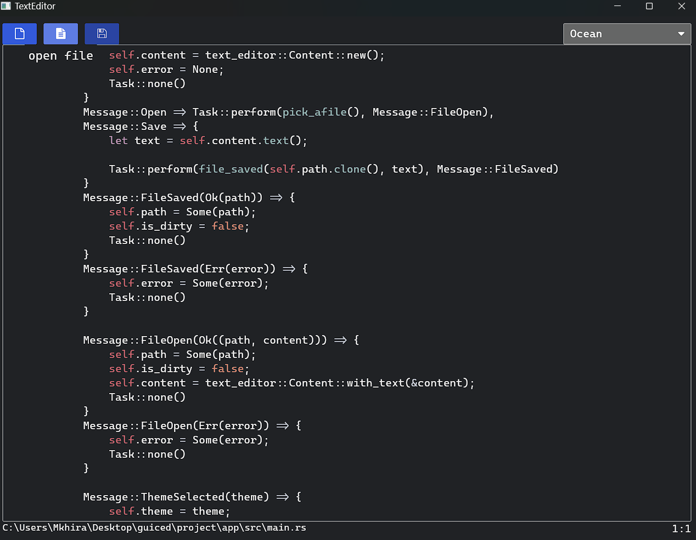

#  Iced Text Editor

A minimal text editor built in **Rust** using the [`iced`](https://github.com/iced-rs/iced) GUI framework, 
- Syntax highlighting via `iced::highlighter`
- File open/save using native dialogs (`rfd`)
- Theme switching (light/dark) via a dropdown
- Editor icons via custom font (`editor-icons.ttf`)

#

